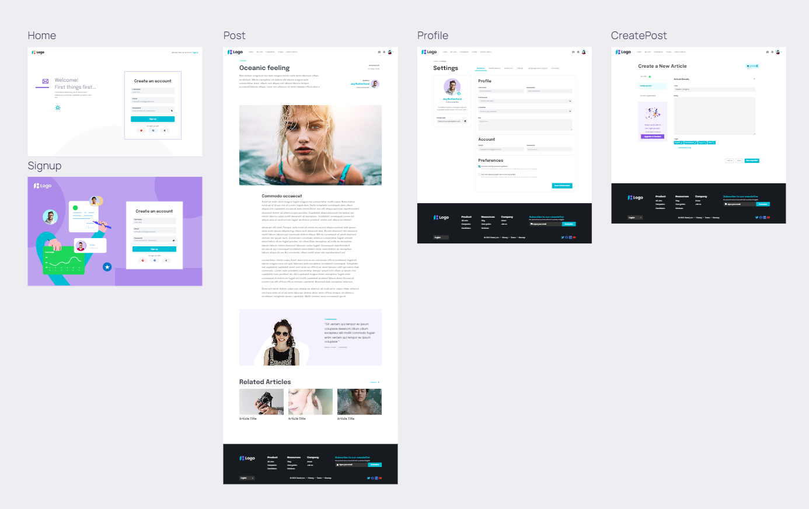

# blog-project

A full stack single-page blog application with CRUD capabilities & user authentication.

## Setup

Run this command to clone the repository into the current directory and `git pull` the newest version to make sure:

```bash
# clones the remote repo into your machine
git clone git@github.com:Luzefiru/blog-project.git
# gets the newest version of the remote repo
git pull
# open the project directory in your text editor of choice
code ./blog-project
```

Once that's done, you'll have to install the `node_modules` dependencies via this command:

```bash
# install dependencies according to package-lock.json
npm install
```

## Running

To host the project on your local machine with live server & webpack's `--watch` option to detect new changes automatically, do:

```bash
# runs the package.json "start" script
npm run start
```

## Contribution Conventions

Here's an example commit flow with git:

```bash
git add .
git commit -m "category: do something"
git push origin main
```

The syntax for making `git commit -m <insert_message_here>` messages should follow this syntax for consistency:

```bash
"category: do something"
```

1. `do something` must be written in [imperative tone](https://www.theserverside.com/video/Follow-these-git-commit-message-guidelines#:~:text=If%20you%20want%20to%20write,Instead%2C%20describe%20what%20was%20done.).
2. `category` must fall under these categories;
   - `feat:` introduces a new feature or component to the codebase
   - `style:` changes a layout, stylesheet, UI look of a certain component
   - `fix:` patches a bug
   - `docs:` any addition pertaining to documentation (comments, README.md, etc)
   - `nit:` small change based on some sort of convention, see [this SO question](https://stackoverflow.com/questions/27810522/what-does-nit-mean-in-hacker-speak).
   - `BREAKING CHANGE:` a change that dramatically changes a pre-existing system - possibly leading to bugs to be patched

# Project Structure

```
blog-project/
├─ node_modules/
├─ public/
│  ├─ index.html
├─ src/
│  ├─ assets/
│  ├─ components/
├─ ├─ ├─ layouts/
├─ ├─ ├─ ui/
├─ ├─ pages/
│  ├─ App.jsx
│  ├─ App.css
│  ├─ index.css
│  ├─ index.js
├─ package.json
```

## The `src/` Directories

1. `assets` - contains images, graphics, font families, etc. that will be imported into `/src`'s files.
2. `components` - contains commonly reused components.
   - `components/layouts` - header, footer, navbar, sidebars, etc.
   - `components/ui` - commonly used UI elements like buttons, lists, links, etc.
3. `pages` - contains folders corresponding to the main pages which serve as `Route`s with React Router

# Wireframe Design



# Contributing
